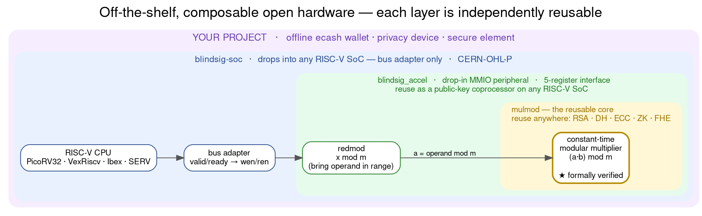

# Blind Signature Accelerator — RISC-V Integration Prototype

An open-source hardware accelerator peripheral for a RISC-V SoC, together with the
firmware that drives it. This repository is the **integration proof-of-concept** for a
larger project: an open hardware accelerator for blind signature operations (blind RSA
and blind Schnorr) targeting RISC-V soft cores on FPGA.

Project site: <https://blindsig-hardware.org> · **Live demo (real RTL in your browser):** <https://cong-or.github.io/blindsig-accel/>



Each layer is independently reusable: the `mulmod` core drops into any modular-arithmetic
design, the accelerator into any RISC-V SoC, the SoC into your product.

## Status — read this first

This is a **feasibility prototype**, not the finished accelerator. Its job is to prove
the toolchain and the CPU↔accelerator integration end-to-end, so that the hard
cryptographic work can be built on a de-risked foundation.

**What works today (and is tested in simulation):**

- A **constant-time modular multiplier** in Verilog (`(a·b) mod m`, bit-serial, fixed
  cycle count independent of the operands) plus a matching modular reducer —
  **formally verified** with SymbiYosys (unbounded k-induction proof of the reduction
  invariant at 32-bit; exhaustive equivalence proof at reduced width).
- A memory-mapped accelerator peripheral wrapping those datapaths, computing
  `operand² mod modulus` — no behavioural `*`/`%`, so it is constant-time end to end.
- A PicoRV32 RISC-V SoC that integrates the accelerator on a memory-mapped bus.
- C firmware and a bare-metal Rust (`no_std`) driver that drive the accelerator and read
  results back — the full `CPU → bus → accelerator → result` path runs end-to-end.

**What is single-word today, and what the funded scope adds:** the arithmetic is real and
constant-time but operates on a single 32-bit word. The operation is a modular squaring
(`operand² mod modulus`, test vector `10² mod 7 = 2`) — the inner step of the
square-and-multiply modular exponentiation the full design is built around. The multiplier
reduces by conditional subtraction; the funded work keeps this constant-time,
formally-verified, bit-serial structure but replaces the reduction with **Montgomery
reduction**, scales it to full RSA-2048/3072 widths, chains it into a modular-exponentiation
pipeline, adds blind Schnorr, and synthesises to the Lattice ECP5 via the open
Yosys/nextpnr/Trellis toolchain. The funded work also cross-checks the RTL against the
`blind-rsa` software reference under **Verilator** co-simulation; the prototype's
testbenches run under Icarus Verilog against an in-bench reference oracle, and the
multiplier is additionally proven equivalent to `(a·b) mod m` by SymbiYosys. The register
interface, the `mulmod`/`redmod` primitives, the formal harness, and the SoC integration
all carry over directly.

The current core also runs on **PicoRV32**; the proposed target core is **VexRiscv**.
The MMIO integration pattern is identical, so the port is a bus-adapter change.

## Layout

The three components are independently useful and each has its own README:

| Directory | What | Reusable as |
|---|---|---|
| [`blindsig-rtl/`](blindsig-rtl/) | Constant-time modular multiplier + reducer + the accelerator peripheral, with testbenches | `mulmod` is reusable for any modular arithmetic (RSA/DH/ECC/ZK) |
| [`blindsig-soc/`](blindsig-soc/) | PicoRV32 SoC integrating CPU + accelerator, with C and Rust firmware | An integration reference for wiring an accelerator to a RISC-V core |
| [`blindsig-fw/`](blindsig-fw/) | Bare-metal Rust (`no_std`) MMIO driver | A firmware driver library for constrained devices |

```
blindsig-rtl  ──(accelerator RTL)──┐
                                    ├─►  blindsig-soc  (PicoRV32 + accel + firmware)
blindsig-fw   ──(driver API)────────┘     proves the full stack in simulation
   register map & sequence mirrored in the SoC's C firmware
```

## Register interface

Base address `0x2000_0000`:

| Offset | Register | Notes |
|---|---|---|
| `0x00` | CTRL    | bit0 START, bit1 RESET, bit2 LOAD_OP, bit3 LOAD_MOD |
| `0x04` | STATUS  | bit0 BUSY, bit1 DONE, bit2 ERROR |
| `0x08` | OPERAND | operand input |
| `0x0C` | RESULT  | result output |
| `0x10` | MODULUS | modulus input |

Sequence: `reset → load_mod → load_op → start → wait(DONE) → read`.

## Building and testing

Requires [Icarus Verilog](https://steveicarus.github.io/iverilog/) (`iverilog`/`vvp`).
The SoC firmware additionally needs a bare-metal RISC-V C toolchain
(`riscv-none-elf-gcc`, e.g. the [xPack](https://xpack.github.io/) build) on `PATH`.

```sh
# Accelerator RTL testbench (no C toolchain needed)
cd blindsig-rtl && make          # → "ALL TESTS PASSED" (4/4)

# Full SoC integration test (needs riscv-none-elf-gcc)
cd blindsig-soc && make          # → "PASS: Integration test succeeded"

# Everything, with narration
./test.sh --ci
```

## Licensing

- **Hardware** (Verilog RTL in `blindsig-rtl/` and the accelerator/bus RTL in
  `blindsig-soc/`): [CERN-OHL-P-2.0](blindsig-rtl/LICENSE) (permissive open hardware).
- **Software** (Rust driver, C firmware, tooling): dual-licensed
  [MIT](LICENSE-MIT) OR [Apache-2.0](LICENSE-APACHE), at your option.

`blindsig-soc/rtl/picorv32.v` is the third-party [PicoRV32](https://github.com/YosysHQ/picorv32)
core by Claire Xenia Wolf, vendored unmodified under its original ISC license (see the file
header). All other RTL, firmware, and tooling is original work.
